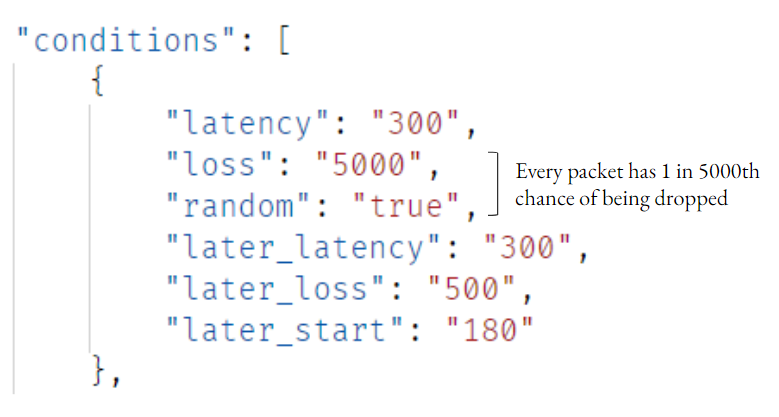

# What is DANE?
DANE, which stands for Data Automation and Network Emulation, is a dataset generation tool that can emulate diverse ranges of network traffic representative of the real world. The DANE tool allows us to custom configure network conditions such as latency and packet loss and generate network traffic data associated with the configured conditions.

# How to generate data with DANE
Tutorial on DANE using Linux machine.
### 1. Environment Setup
The following packages are required to use DANE for data generation:
* `make`
* `docker.io`
* `docker-compose`  

Next, you can install the modified DANE repository using:  
```
git clone https://github.com/jenna-my/modified_dane --recursive
```

Lastly, navigate to the `modified_dane` directory and run the following to complete the installation:
```
sudo make build
```
### 2. Configure different network conditions with DANE
Now that DANE is installed, you can begin configuring the network conditions that you wish to emulate. You can input custom network conditions by editing the `config.json` file, which contains the configured network parameters for each DANE run.

To edit the config.json file, run:
```
nano config.json
```

Below is a sample configuration of one DANE run in the **config.json** file.


As you can observe, there are a total of six configurable conditions:
* `latency` - the latency in ms
* `loss` - the denominator of the packet loss ratio. For example, if set to 5000, you are setting the packet loss ratio as 1/5000.
* `random` - whether to randomly or deterministically drop packets. If set to `True`, packets will be dropped randomly from a uniform distribution. This means that if, for example, the loss was set to 5000, then every packet would have a 1 in 5000th chance of being dropped. If set to `False`, packets will be dropped deterministically. For an example loss of 5000, this would mean that every 5000th packet would be dropped.
* `later_latency` - the latency in ms which will be applied later in the DANE run
* `later_loss` - the denominator of the packet loss ratio which will applied later in the DANE run
* `later_start` - the second at which `later_latency` and `later_loss` should be applied

### 3. Run DANE Test
After configuring the network conditions, you may now run DANE by typing:
```
sudo make up
```
The DANE test should begin executing 

### DANE outputs
For each run, DANE should be outputting two csv files: the raw network data and the losslog data. The raw network file contains the traffic data for that particular run, while the losslog file contains the actual dropped packets. The losslog file allows us to calculate the empirical number of dropped packets for the DANE run. 


[<- Back to home page](index.md)
