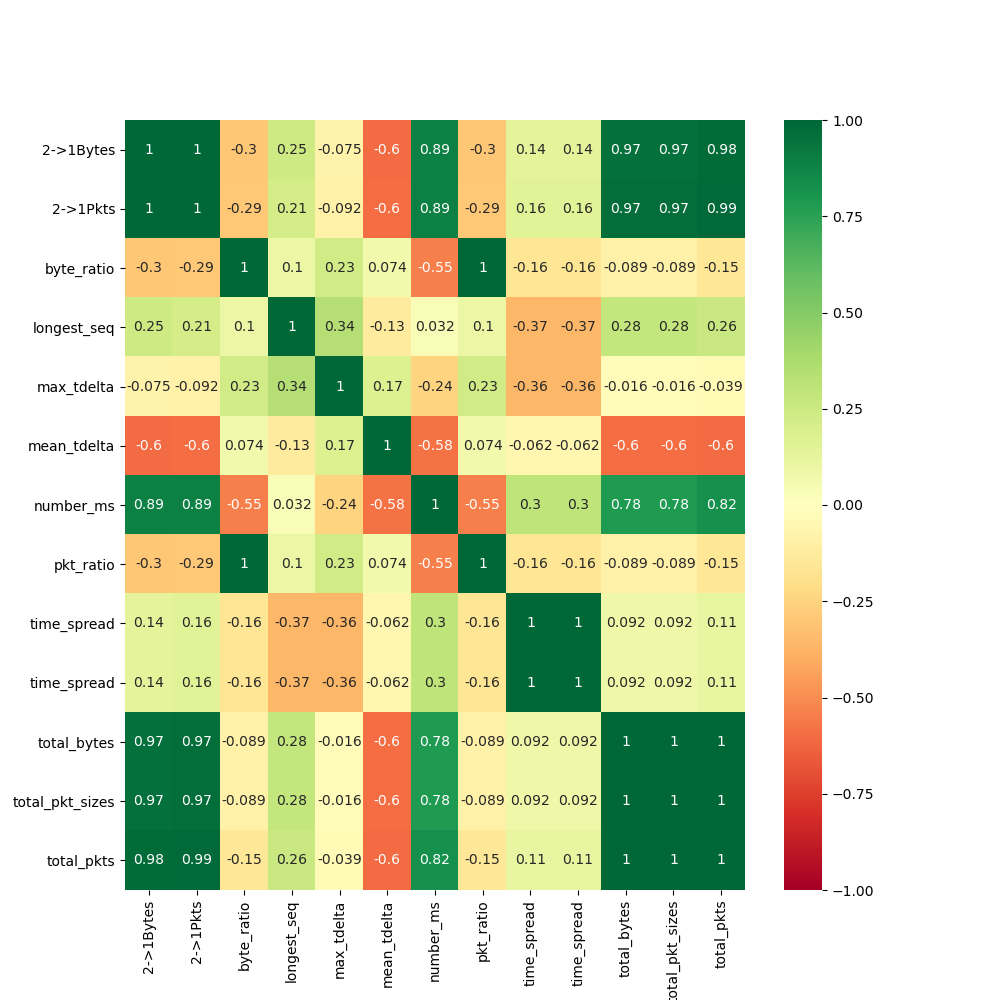
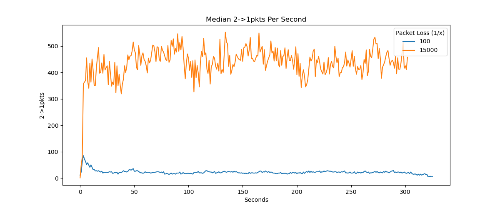
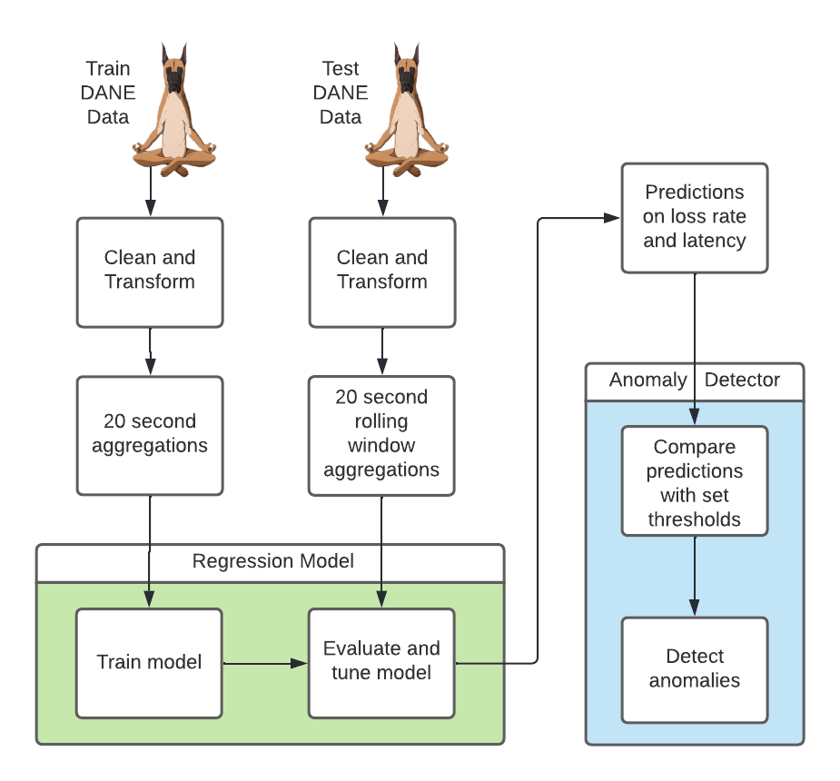
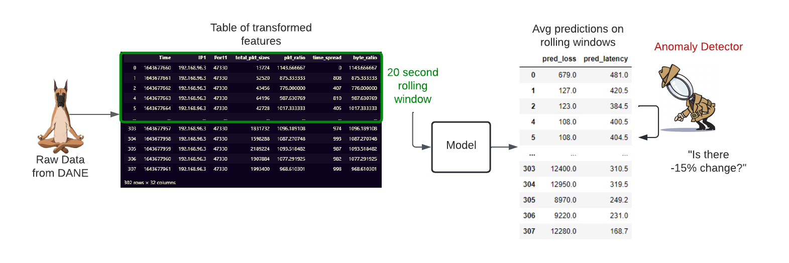
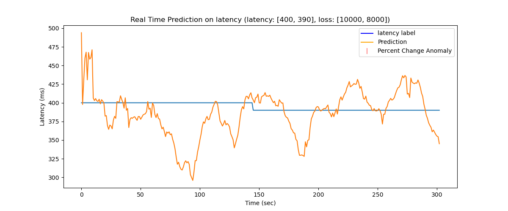
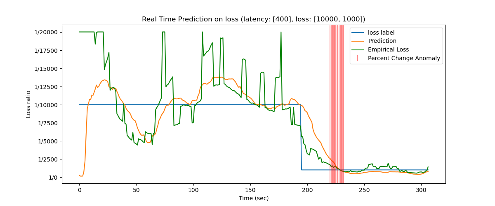
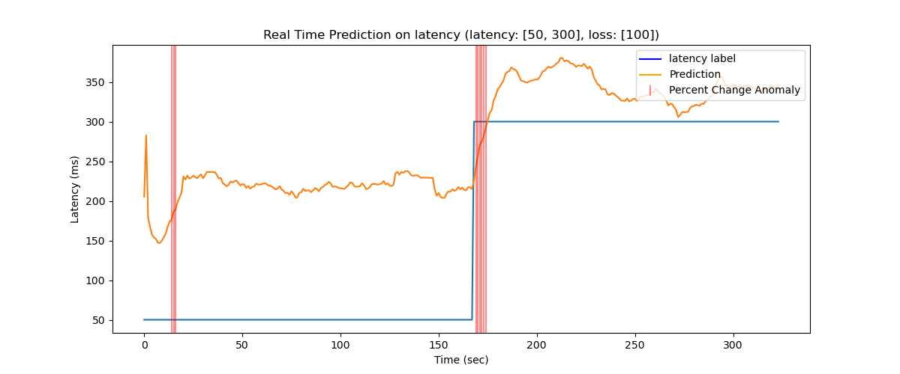

# Network Signal Anomaly Detection
#### by the Anomaly Detectives
Laura Diao, Jenna Yang, Benjamin Sam

# Overview
In order to detect issues in network transmission data, we built a real-time-capable anomaly detection system. This system includes both alerting and monitoring features, which would enable Internet Service Providers (ISP's) such as Viasat to properly monitor user network performance and quality in real time. Moreover, detection in real-time would allow Viasat to handle issues more promptly and increase customer satisfaction. The system utilizes simulated network traffic data to train a model that predicts the packet loss rate as well as the latency of an internet connection, and uses these as well as certain features derived from the data to determine whether an adverse event is occurring.

# Quick Links
- [Main GitHub Repository](https://github.com/LauraDiao/Q2)
- [Modified DANE](https://github.com/jenna-my/modified_dane)

# Introduction
Network degradation occurs in many forms, and our project will focus on two common factors: packet loss and latency. Packet loss occurs when one or more data packets transmitted across a computer network fail to reach their destination. Latency can be defined as a measure of delay for data to transmit across a network. For internet users, high rates of packet loss and significant latency can manifest in jitter or lag, indicators of overall poor network performance as perceived by the end user. Thus, when issues arise in these two factors, it would be beneficial for service providers to know exactly when the user is experiencing problems in real time. In real world scenarios, situations or environments such as poor port quality, overloaded ports, network congestion and more can impact overall network performance.

[A deeper discussion on networks and common problems with packet loss and latency.](network-domain.md)

# Data
Using a tool called DANE, we could generate records of simulated network traffic with varying rates of packet loss and latencies. This helped us create and capture data of a wide variety of unique network conditions. We then built on top of this dataset by transforming them in the process of feature engineering based on investigations made about their distributions.

## Data Generation with DANE
The simulated network data used for our models were generated with a network emulation tool built by a previous capstone project team. DANE, which stands for [Data Automation and Network Emulation](https://dane-tool.github.io/dane/), is a dataset generation tool that can emulate diverse ranges of network traffic representative of the real world. The DANE tool allows us to custom configure network conditions such as latency and packet loss and generate network traffic data associated with the configured conditions.
For any anomaly detection system, diversity in conditions is crucial to adequately cover the variance of real world scenarios. With a feature to create custom profiles of network traffic scenarios, DANE allows us to properly emulate the diversity and variety of network conditions that occur in the real world. 

The data generated by DANE for our project includes various packet loss and latency scenarios in which packets were dropped randomly from a uniform distribution. For each scenario, a simulated "anomaly" is configured around midpoint time by changing the loss and latency values. For example, the set loss would drop from 20000 to 200, indicating a major shift in loss which would be the simulated anomaly (we discuss our definition of an anomaly later in the anomaly classifier section). Empirical loss values are also included from DANE as a true value measure against the predicted values of our model. This data was generated manually on our Windows computers.

For a more in depth explanation and tutorial of DANE in the context of our project, please click [here](dane-details.md).

## Exploring the Feature Space

The matrices below illustrate the correlations between a combination of temporal and throughput-based features that were engineered for our model. 

In our exploration of the features, we found that the most effective features that captured network behaviors could be categorized into two distinct categories: temporal-based and throughput-based. The temporal features used are as follows:
- `number_ms`: The number of unique millisecond timestamps between seconds
- `mean_tdelta`: The mean of differences between sequential packet transmission timestamps between seconds
- `max_tdelta`: The maximum of differences between sequential packet transmission time stamps between seconds
- `time_spread`: The range between the earliest arriving packet and latest packet timestamp within a second
- `longest_seq`: The longest sequence of consecutive packet transmission time stamps that have the same recorded time stamp to the millisecond

Many of these features were our best proxies for a measure determining the rate at which packets came in, and as a result were useful to our models in predicting latency. There is likely a moderately strong relationship between a packet’s timing in being transmitted and its latency.

The throughput features are as follows:
- `total_pkts`: Total number of packets
- `total_pkt_sizes`: the sum of all byte sizes of each packet in a second, comparable to total_bytes
- `2->1Bytes`: The number of packets received in one second from IP address 2 (sender) to address 1 (receiver).
- `byte_ratio`: The ratio of bytes being received divided by the number of bytes being sent back from IP address 1.
- `pkt_ratio`: The ratio of packets being received divided by the number of bytes being sent back from IP address 1.
- `total_bytes`: the sum of all bytes being sent or received within a second.
- `2->1Pkts`: The number of bytes received in one second from IP address 2 (sender) to address 1 (receiver)

These features on throughput, on the other hand, helped us much more in determining packet loss rates. Our investigations into how connections are established helped us understand that the network throttles when a packet loss event occurs, likely to reduce the burden on the connection path that the packets are taking. Disregarding phenomena such as rate limiting, packets tend to be sent as fast as possible through the network.

# Methods

## Pipeline

	The figure above depicts the data pipeline from start to end for our project.

We first allocate our raw data generated from DANE into train and test sets for our model. Both sets are cleaned and transformed through the same cleaning process. The features for the train set are aggregated over a 20 second window and fed into our regression model for training. After training, we implement performance tuning and grid search to further improve the baseline model.

In order to properly test our model with unseen data and emulate real-time prediction, we transform our test data into 20 second rolling window aggregations that are inputted in intervals into the regression model for evaluation. The rolling windows simulate a real-time anomaly detection system where a model would work on a stream of data and would not be able to look ahead beyond the past and present features. 

Our regression model should output predictions on loss rate and latency in 20 second rolling window aggregations. These predictions act as the fundamental metric driving the classification of what we would consider an anomaly. Our anomaly detection mechanism compares changes in the predictions with a set threshold that ultimately determines whether an anomaly is flagged or not. A deeper explanation of the anomaly classifier is detailed later in the anomaly classifier section. 

	The pipeline was set up locally on our Windows computers as well as in DSMLP.  

## The Regression Model
Most of the models we implemented were tree-based regression models. A general decision tree was able to manage highly correlated features. This tree based model considers all possible outcomes of a decision and traces each path to a conclusion. However, the lack of randomness in this model can lead to overfitting when dealing with too many variables. 

On the other hand, in a randomized decision tree, each tree in the ensemble is built from a sample drawn with replacement (from training data). The best split is found either from all input features or a random subset of size max_features. Overall a randomized decision tree is good for reducing variance. This is good for overfitting, but may lead to bias. 

The model we landed on was the extra trees model. This model is similar to the randomized decision tree, however instead of taking the best split of features, a random subset of candidate features is used. For an extra trees model, thresholds are drawn at random for each candidate feature and the best of these randomly-generated thresholds is picked as the splitting rule. This method can reduce more variance than a random forest, but can lead to even more bias. 
Recap of feature calculation/values: 
Packet loss features used: `byte_ratio`, `pkt_ratio`, `time_spread`, `total_bytes`, `2->1Pkts`

To predict for loss, which is how many bytes that fail to reach the destination port, using features related to throughput information was valuable to provide the model with the relevant information. Some of these features include bytes to packet ratio, packet ratio, total bytes, and the bytes that were able to travel from the sender to the receiver. 
 
Latency features used: `total_pkts`, `total_pkt_sizes`, `2->1Bytes`, `number_ms`, `mean_tdelta`, `max_tdelta`, `time_spread`, `longest_seq`

To predict for latency, which is the time in milliseconds it takes for a packet of data to travel from the sender to the receiver, features such as the number of unique millisecond timestamps between seconds, the maximum and means of differences between sequential packet transmission time stamps between seconds, provided the model with useful information on variance to train on.  Interruptions to smooth transmission of data can impact latency, so the addition of features like the longest sequence of consecutive packet transmission time stamps allows the model to train on packet travel patterns and when interruptions occur. 

As both of the models deal with features that are highly correlated, eg. measure byte ratio/transmission and packet/temporal information, applying PCA found a new set of variables, reducing the dataset dimensionality to four and retains 99 percent of the variance of the original dataset, retaining its trends and patterns. This smaller dimension has the benefit of speeding up the model training process. 

 

## Anomaly Classifier

Finally, we implemented and integrated the anomaly detection mechanism for the system, which ingested the predictions from our regression model and identified anomalies in 20 second windows. We narrowed our definition of an anomaly to any significantly rapid increase in packet loss rate/latency over two seconds. We then manually tuned for percent change thresholds that worked well for detecting these events.

## Results 
Overall, the predictive model performance was moderately low. Using the metric of Mean Absolute Percent Error, we determined that the model’s predictions on average were off by about 40-70%. Using our other metric of _predictions that fell within a 15% margin_, we saw that predictions that fell within our acceptable error rates made up a measly 10-20% on all test set predictions.

Regardless of the model’s middling performance on prediction, we were still able to produce a functional anomaly classification system on top of these predictions. Shifting our focus from model performance on static predictions to shifts in predictions, we utilized the prediction values in this real-time paradigm to detect significant changes in the output based on percent change between seconds. With a moderate amount of manual tweaking, we came up with two functional thresholds for changes in predictions. For finding anomalies in latency, we decided that a 6% shift in predictions over the span of two seconds gave a good balance of low false positive rate and decent anomaly classification accuracy in the resulting network configuration record. For packet loss rate, the percentage shift was 15%.

# Conclusions
In general, the performance of our regression model for predicting loss and latency were not as accurate as we would have liked. Tuning our regression model and attempting to improve its predictions was certainly one of the prominent challenges of the project. 

Nonetheless, our predictions in the larger scheme followed a similar trend to the empirical loss values and static loss labels. With these trends and utilizing the threshold mechanism for classification, we were able to achieve relatively successful detection of anomalies, with about 80% of the test anomalies accurately identified by our system. Since we are building an anomaly detection system which is meant to find patterns of increasing loss over a period of time, we consider the system to be a success in that regard. We found that the hurdle of inaccurate predictions did not have an immense impact on the broad view of classifying anomalies, although the classification accuracy could still be improved further.  

## Why our results were important
	While our predictions still need improvement, we were to explore the complexity of predicting loss and latency and come up with some useful potential features for such a model. Predicting loss and latency in real-time can have many benefits in equipping network providers with more actionable information to drive improvements in the network experiences of their customers. Predictions that are real-time can be especially helpful in reducing delays between network degradation and service provider response. More data and information on the nature of these anomalies and what leads up to them allows for more thorough and correct responses to degradation from the service provider. An anomaly detection system with loss and latency model could have valuable practical use in this regard given that the model would be able to analyze throughput information leading up to an anomaly. Furthermore, the anomaly identification mechanism of our system, if extended to a monitoring or alerting system, can provide a comprehensive medium for service providers to supervise network performance in a more continuous and prompt manner.

## Limitations
Our project does come with a few notable limitations:

	Firstly, due to the complexities in capturing real network traffic data with empirical values, our project hinged on solely the simulated data generated by DANE. While DANE is designed as an emulator of networks, it is not fully indicative of the entire spectrum of problems that a network may encounter in the real world. If deployed in production, our system would likely experience worse performance as it is biased to the simulated data of DANE. For the purposes of our project, DANE provided the most practical and viable approach to data generation. However it is meaningful to note that this means our system is heavily biased towards the simulated data which would need to be properly handled in a real world environment.

	Relying on DANE for our data generation process also presents resource constraint issues that could affect the quality of the data generated for our project. The data for our project was generated concurrently in multiple runs. Especially in low packet scenarios that are demanding the upper limits of computational power, running multiple DANE concurrently can result in inexact data. This is because the system/CPU cannot provide enough resources at the time to properly execute the DANE runs together, resulting in delays. These delays manifest in the data through times that are slightly off or inaccurate.

	Another limitation is the fact that we attempted to predict anomalous activity using these predictions. While this approach is novel in itself, there was a natural consequence of having more false positives in our anomaly detection system due to the increased inaccuracy of the prediction. From an information standpoint, using predictions instead of a defined feature such as those related to throughput likely resulted in signal degradation and a decreased power in our classification results.

# Special Thanks
- [UCSD Halıcıoğlu Data Science Institute](https://datascience.ucsd.edu/)
- [Viasat](https://www.viasat.com/)
- [DANE](https://github.com/dane-tool/dane)

